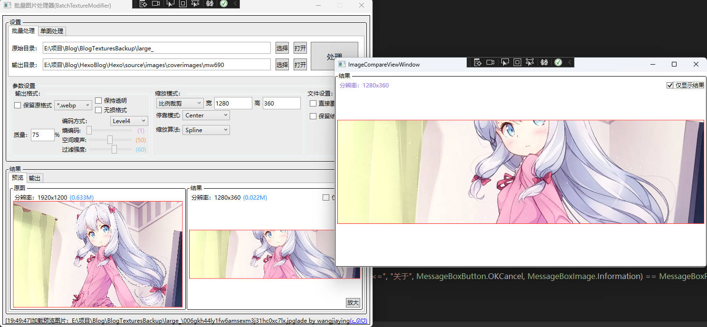
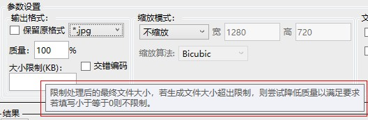

# BatchTextureModifier

批量图片处理工具，使用 WPF .NetCore6.0 开发

目前支持：

1. 批量处理图片(也可以单图处理)
2. 预览修改效果、及修改后文件大小
3. 覆盖修改、自动备份(前提是直接覆盖修改的话)
4. 多种模式缩放图片
5. 按照指定参数，批量转换图片格式为 `*.png` `*.jpg` `*.webp` `*.tga` `*.bmp` `*.gif`
6. POT缩放(玩过 Unity 的应该知道什么意思，不过这个跟 Unity 拉伸方式不同)
7. 多线程处理，同时开启处理量取决于CPU核心数目

# 更新日志

* V1.1.0(2023.2.3)
	* 预览图异步加载，避免图太大导致卡界面
	* 若转化 `tga` 格式不再加载预览图，并取消其预览报错及弹窗提示
	* 增加对处理图片后文件大小的限制选项：若处理后文件大小超出指定限制，则尝试降低质量以满足需求
	* 优化批量处理时的取消操作

* V1.0.0(2023.1.22)
	* 第一版

# 其它

开发记录：[开发一个批量图片处理工具
](https://wangjiaying.top/2023/01/21/%E5%BC%80%E5%8F%91%E4%B8%80%E4%B8%AA%E6%89%B9%E9%87%8F%E5%9B%BE%E7%89%87%E5%A4%84%E7%90%86%E5%B7%A5%E5%85%B7/)

# 使用

UI 觉得做的挺简单的，直接看图吧。

主页：

日志：

大多数选项将鼠标移动上去时，会进行对应的提示：

# 感谢

图片处理基于图像库 [ImageSharp](https://github.com/SixLabors/ImageSharp)